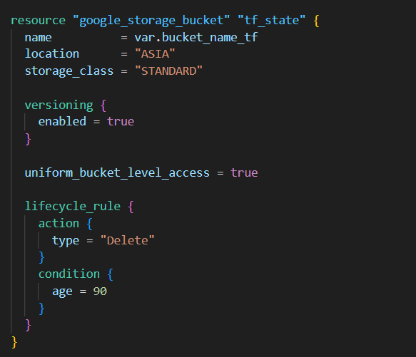

# 1. Create a Service Account for Terraform

```conf
gcloud iam service-accounts create terraform-sa --description="Service Account for Terraform" --display-name="terraform-sa"
```

# 2. Grant the necessary roles for Service Account 

```conf
gcloud projects add-iam-policy-binding devops-467006 --member="serviceAccount:terraform-sa@devops-467006.iam.gserviceaccount.com" --role="roles/storage.admin" --role="roles/resourcemanager.projectIamAdmin" --role="roles/iam.serviceAccountAdmin" --role="roles/artifactregistry.admin" --role="roles/serviceusage.serviceUsageAdmin" --role="roles/iam.serviceAccountKeyAdmin"
```

# 3. Create workspace for Terraform

```conf
terraform workspace new prod
```

# 4. Create a GCS Bucket for Terraform State


