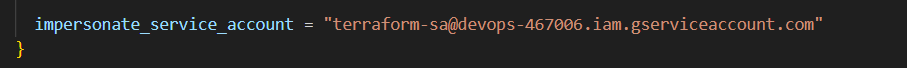

# 1. Summary

- **This project uses two separate service accounts**

- **Terraform Service Account**

    - Used by Terraform to create and manage Google Cloud resources (e.g., Cloud Run, Artifact Registry, IAM).

- **GitHub Actions Service Account**

    - Used by GitHub Actions workflows (CI/CD pipeline) to deploy applications.

# 2. Create a Service Account for Terraform

```conf
gcloud iam service-accounts create terraform-sa --description="Service Account for Terraform" --display-name="terraform-sa"
```

# 3. Grant the necessary roles for Service Account 

```conf
gcloud projects add-iam-policy-binding devops-467006 --member="serviceAccount:terraform-sa@devops-467006.iam.gserviceaccount.com" --role="roles/storage.admin" --role="roles/resourcemanager.projectIamAdmin" --role="roles/iam.serviceAccountAdmin" --role="roles/artifactregistry.admin" --role="roles/serviceusage.serviceUsageAdmin" --role="roles/iam.serviceAccountKeyAdmin"
```

- `roles/storage.admin` – manage GCS buckets and objects (for remote state).  
- `roles/resourcemanager.projectIamAdmin` – manage IAM policy at project level.  
- `roles/iam.serviceAccountAdmin` – create and manage service accounts.  
- `roles/artifactregistry.admin` – manage Artifact Registry repositories and images.  
- `roles/serviceusage.serviceUsageAdmin` – enable and manage GCP services (APIs).  
- `roles/iam.serviceAccountKeyAdmin` – create and manage service account keys.

# 4. Authenticate with Application Default Credentials (ADC) and grant impersonation rights

```config
gcloud auth application-default login
```

```config
gcloud projects add-iam-policy-binding "<project-name>" --member="user:<account>@gmail.com" --role="roles/iam.serviceAccountTokenCreator"
```

Provider block with impersonation in main.tf




# 5. Initialize Terraform

```conf
terraform workspace new prod
```

```config
terraform init
```

```config
terraform plan
```

```config
terraform apply
```

# 6. Create a GCS Bucket for Terraform State

You can see this configuration in the `main.tf` file.


# 7. Migrate statefile from local to GCS bucket

```config
terraformm init -reconfig
```

You can see this configuration in the `terraform.tf` file.


# 8. Create Google Artifact Registry


# 9. Create Service Account for Github Actions

You can see this configuration in the `modules/iam/main.tf` file.


I create a Service Account for github actions and grant it three roles:

- `roles/artifactregistry.writer` - allow pushing container images to Artifact Registry.

- `roles/run.admin` - allow managing Cloud Run services.

- `roles/iam.serviceAccountUser` - allow this Service Account to be used when deploying Cloud Run.